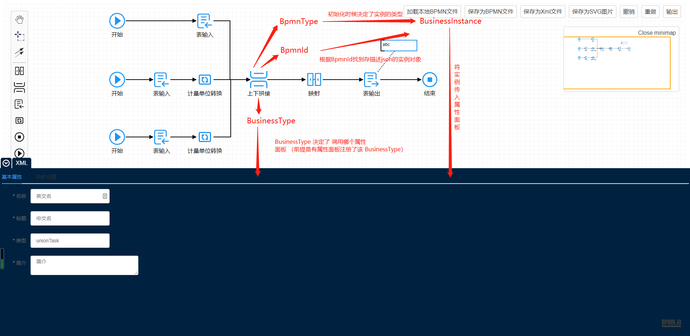

# EtlManager

> 关键词 `BpmnManager` `AttributePanel`

**EtlManger** 由两部分核心组成，一个是流程管理器 `BpmnManager` ，一个是对流程进行描述的属性面板 `AttributePanel` ；对于后台来说，`BpmnManager` 负责生成 `XML` ，属性面板负责生成 `json`

## Bpmn 对象

> 关键词 `bpmnType` `businessType` `businessInstance`

- 所有被封装的 **bpmn** 的组件对象都存在两个分类，一个是 **bpmn** 的类型分类 `bpmnType` ，一个是业务层面的分类 `businessType` ；

- 对于后台来说，`businessType` 是基于 `bpmnType` 抽象出来的 2 级分类，所有相同 `bpmnType` 的对象都来自同一个类（至少从前后台数据交互上是这样的）；所以前端会根据 `bpmnType` 封装对应的 `businessInstance` （从命名角度来说 `bpmnInstance` 可能更合适，但是业务上容易混淆，毕竟是使用者至上），即当前的 `MappingTask` 、`TableSinkTask` 、`TableSourceTask` 、`UnionTask` 、`UnitConvertTask` 都共用一个 `businessInstance` 类对象来管理 `json`，每个具体的组件的描述 `json` 会存储在对应的 `businessInstance` 中；这就要求其上组件的描述 `json` 中部分结构层面要相同；
- `BpmnManager` 中元素的 `bpmnType` 决定了 `businessInstance` 的类型；`bpmnId` 决定了具体的描述 `json` 存储在哪个 `businessInstance` 中 ; `businessType` 决定了使用哪个属性面板 `AttributePanel`

### Task 类型结构要求

以下属性必须有的原因是前后端交互的时候需要这些字段，所以通用的部分必须取信息的逻辑一致

```js
{
    // 必须有 baseTask
    "baseTask": {
    // 必须有 baseTask.taskDesc
    "taskDesc": "简介",
    // 必须有 baseTask.jobDesc
    "jobDesc": "中文名",
    // 必须有 baseTask.taskName
    "taskName": "英文名",
    }
}
```

### Bpmn 对象关系图



## EtlManager 可配置项

```vue
<script>
export default {
    data(){
        return {
            // 扩展数组 选填 构成详见后续两节
            extendedPluginConfig: [],
            // 是否启用自定义控制器 默认 true ；开启后 extendedPluginConfig 中则需要配置 customPalette 字段
            isOpenCustomPalette: true,
            // etlid
            etdId: ""
            // 运行模式 没有预置的纯净版 pure 和 预置好组件的 basic
            mode: "pure"
        }
    }
}
</script>

<template>
  <!-- 通过props传入 -->
  <elt-manager
    :extended-plugins="extendedPluginConfig"
    :is-open-custom-palette="isOpenCustomPalette"
    :etl-id="etdId"
    :mode="mode"
  />
</template>
```

## bpmn 点击操作和属性面板的交互逻辑


## 扩展组件注册

```vue
<script>
import { pluginBuilder } from "../EtlManager/builder"
import AttributePanel from "xxx.vue"
import AttributeValidator from "xxx.js"

// 配置信息
const pluginConfig = {
  // 组件名称 要求 pluginName === attributePanel.panel.name === bpmnPluginConfig.businessType
  pluginName: "mappingTask",
  // 属性面板配置项
  attributePanel: {
    // 属性面板的容器
    panel: AttributePanel,
    // 属性面板的校验逻辑
    validator: AttributeValidator,
  },
  bpmnPlugin: {
    // bpmn 标准对应标签
    bpmnType: "bpmn:ServiceTask",
    // 组件业务类型
    businessType: "mappingTask",
    // 控制条/点击操作台 分组类型 一般都是model
    group: "model",
    // 控制条/点击操作台 className 用于配置背景图
    className: "fusion-bpmn-mapping-task",
    // 控制条/点击操作台 鼠标hover时显示的文本
    businessLabel: "映射",
    // 组件对应xml写入的kv属性对
    xmlConfig: {
      "flowable:class":
        "com.gwssi.focus.schedulecenter.flow.ServiceTaskExecutor",
    },
    // 组件拖拽到画布上的渲染配置
    rendererConfig: {
      // 直接渲染的svg文本，也可以用url替换，url的优先级低于svgText;
      // 如配置url，若url是svg则返回的时候会读取svg内容，类似设置svgText;如果不是svg类型，则直接生成image标签，image标签不能设置状态颜色
      svgText: `<svg t="1629352679859" class="icon" viewBox="0 0 1024 1024" version="1.1" xmlns="http://www.w3.org/2000/svg" p-id="16170" xmlns:xlink="http://www.w3.org/1999/xlink" width="48" height="48"><defs><style type="text/css"></style></defs><path d="M894.85 120.49H591.8a30.9 30.9 0 0 0-30.87 30.87V476.2H473V151.36a30.9 30.9 0 0 0-30.87-30.87h-303a30.9 30.9 0 0 0-30.87 30.87v704.33a30.9 30.9 0 0 0 30.87 30.87h303.05A30.9 30.9 0 0 0 473 855.69V534.3h87.88v321.39a30.9 30.9 0 0 0 30.87 30.87H895a30.63 30.63 0 0 0 30.69-31.8v-703.4a30.9 30.9 0 0 0-30.84-30.87z m-479.91 708H166.37V178.6h248.57z m452.67 0H619V178.6h248.61z" p-id="16171"></path><path d="M261.51 440.07h58.1v130.19h-58.1zM714.36 440.07h58.1v130.19h-58.1z" p-id="16172"></path></svg>`,
      // 渲染元素的坐标和尺寸
      attr: {
        // 图形左位移 默认 0
        x: 0,
        // 图形左位移 默认 0
        y: 0,
        // 图形宽度 默认 48
        width: 48,
        // 图形高度 默认 48
        height: 48,
      },
    },
  },
}

export default {
  data() {
    return {
      // 构建扩展插件配置项，注意是个数组对象
      extendedPluginConfig: [pluginBuilder(pluginConfig)],
    }
  },
}
</script>

<template>
  <!-- 通过props传入 -->
  <elt-manager :extended-plugins="extendedPluginConfig" />
</template>
```

## 扩展组件注册 2

除了以上方式 也可以使用 bpmnManager 中暴露的预设组件 config 或 组件 直接注册

```vue
<script>
import {
    // bpmn插件构造器，传入json
    CustomPluginBuilder,
    // 预设组件 json
    FusionBpmnMappingTaskConfig,
    FusionBpmnTableSinkTaskConfig,
    // 预设组件
    FusionBpmnTableSinkTask,
} from "../BpmnManager"
import AttributePanel from "xxx.vue"
import AttributeValidator from "xxx.js"

// 使用 bpmn插件构造器 创建bpmn插件
const customBpmnMappingTask = CustomPluginBuilder(FusionBpmnMappingTaskConfig)
// 配置 扩展组件
const extendedMappingTask = {
    // 组件名称 要求 pluginName === attributePanel.panel.name === bpmnPluginConfig.businessType
    pluginName: FusionBpmnMappingTaskConfig.businessType,
    // bpmn插件
    bpmnPlugin: customBpmnMappingTask,
    // 如果该bpmn组件需要使用自定义控制面板代理控制生成组件逻辑则配置
    customPalette:{
        // 显示文本 无硬性要求但是最好和 businessLabel 一致
        label: FusionBpmnMappingTaskConfig.businessLabel，
        // 图标样式类和用于代理触发的样式类 必须和 bpmn插件配置中 className 一致 否则会找不到对应的按钮 无法代理
        className: FusionBpmnMappingTaskConfig.className
        // 分组信息 选填 可以把同一分组的按钮放到一起 并把不是同一组的按钮间加分割线 建议配置成中文名 以后可能会展示该字段
        group: FusionBpmnMappingTaskConfig.group || "xxx",
    },
    // 如果需要配置对应的属性面板则配置
    attributePanel: {
        // 属性面板的容器
        panel: AttributePanel,
        // 属性面板的校验逻辑
        validator: AttributeValidator,
    },
}

// ======================================================

// 直接使用 bpmn插件 配置 扩展组件
const extendedTableSinkTask = {
    pluginName: FusionBpmnTableSinkTaskConfig.businessType,
    bpmnPlugin: FusionBpmnTableSinkTask,
    customPalette:{
        label: FusionBpmnTableSinkTaskConfig.businessLabel，
        className: FusionBpmnTableSinkTaskConfig.className
        group: FusionBpmnTableSinkTaskConfig.group || "xxx",
    }
}

export default {
    data(){
        return {
            // 构建扩展插件配置项，注意是个数组对象
            extendedPluginConfig: [extendedMappingTask, extendedTableSinkTask]
        }
    }
}
</script>

<template>
  <!-- 通过props传入 -->
  <elt-manager
    :extended-plugins="extendedPluginConfig"
    :is-open-custom-palette="true"
  />
</template>
```

## 属性面板配置项详解

```js
const AttributePanelConfig = {
  // 属性面板
  config: {
    // 属性面板tab按钮显示文本
    label: "Code",
    // 鼠标移入属性面板tab按钮时显示的文本
    desc: "实时代码状态查询",
    // 属性面板tab按钮是否默认常驻显示
    isLocked: true,
    // 属性面板是否仅在选中该面板时存在；设置为false时，切换其他面板的时候，该面板自动销毁
    isStatic: false,
    // 是否时bpmn组件从属的属性面板；人为设置无效，仅当配置属性面板的同时配置bpmnPlugin参数时为true，选中对应bpmn组件时自动展示该面板
    isBpmn: true,
  },
  // 属性面板vue对象
  panel: CodeEditorPanel,
}
```

## 约束条件

### 关于属性面板与 EtlManager 对象数据交互

#### 关于 EtlManager 向 属性面板 传参

```html
// 所有 属性面板 会接受的 props 有 3 个 // 分别未 bpmnId businessInstance
etlManager

<attribute-panel
  :bpmn-id="bpmnId"
  :business-instance="businessInstance"
  :etl-manager="etlManager"
/>

// 就所有bpmn组件来说 以上三个参数都是肯定有的 // 但是某种情况下 bpmnId 和
businessInstance 可能为空
```

#### 属性面板和 EltManager 交互

```js
// 获得基础属性
businessInstance.bpmnType
businessInstance.taskId
businessInstance.etlId
businessInstance.taskType
businessInstance.jobDesc

// 获得描述json
businessInstance.getConfig()

// 更新描述json
businessInstance.updateConfig(config)

// 获得当前节点
etlManager.getBpmnElement(elementId)

// 获得所有节点 （包括 图形 连线 文本等 需要根据 element.type 判断区分）
etlManager.getAllBpmnElement()

// 获得当前节点 来源 节点列表 bpmn节点
etlManager.getSourceBpmnElement(elementId)

// 获得当前节点 来源 节点id列表
etlManager.getSourceBpmnElementId(elementId)

// 获得当前节点 去向 节点列表 bpmn节点
etlManager.getTargetBpmnElement(elementId)

// 获得当前节点 去向 节点id列表
etlManager.getTargetBpmnElementId(elementId)

// 重绘节点
etlManager.redrawBpmnElement(elementId)

// 重绘所有节点
etlManager.redrawBpmn()

// 高阶。。。。

// 直接获得 bpmnManager
etlManager.getBpmnManager()

// 直接获得 所有 业务实例 列表
etlManager.getBusinessInstanceMap()

// 直接获得 bpmn 的 xml
etlManager.getBpmnXML()

// 更改任务状态
// READY 未执行
// SUCCESS 执行成功
// FAILED 执行失败
// ERROR 校验失败

import { ELEMENT_STATE } from "eltManager/base/static"

etlManager.setBpmnElementState(elementId, ELEMENT_STATE.READY)
etlManager.setBpmnElementState(elementId, ELEMENT_STATE.SUCCESS)
etlManager.setBpmnElementState(elementId, ELEMENT_STATE.FAILED)
etlManager.setBpmnElementState(elementId, ELEMENT_STATE.ERROR)
```

#### svg 约束条件

针对 `rendererConfigsvgText` 和 `rendererConfig.url` 为 `.svg` 结尾的文件内容，svg 文本有以下要求

- 由于使用的第三方插件只会选取 svg 文本内第一个元素放置到画布上，svg 文本首标签必须是 `<svg>`
- 由于需要画布上的组件需要根据状态更换颜色，所以 svg 文本标签内，禁止设置 `fill` ，因为内联的 `fill` 属性在浏览器解析时优先级高于父容器继承过来的属性

#### 扩展组件校验方法返回值约束

```js
// validator 方法只能返回以下格式
/**
 *	@returns {Boolean} result
 *	@returns {String} [message]
 */

// 校验通过
return {
  result: true,
}

// 校验错误
return {
  result: false,
  // 该字段内容会通过弹窗形式展示
  message: "xxx",
}
```
